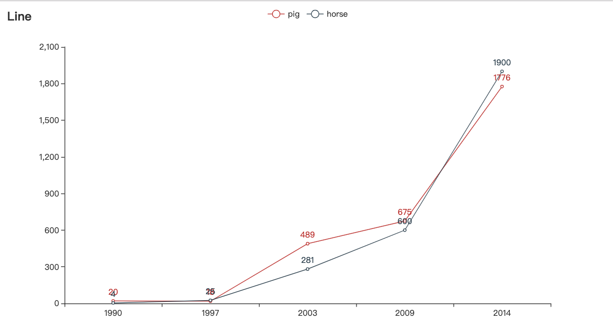
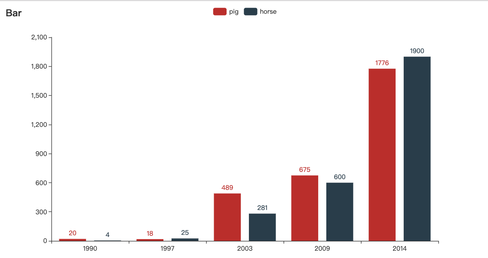
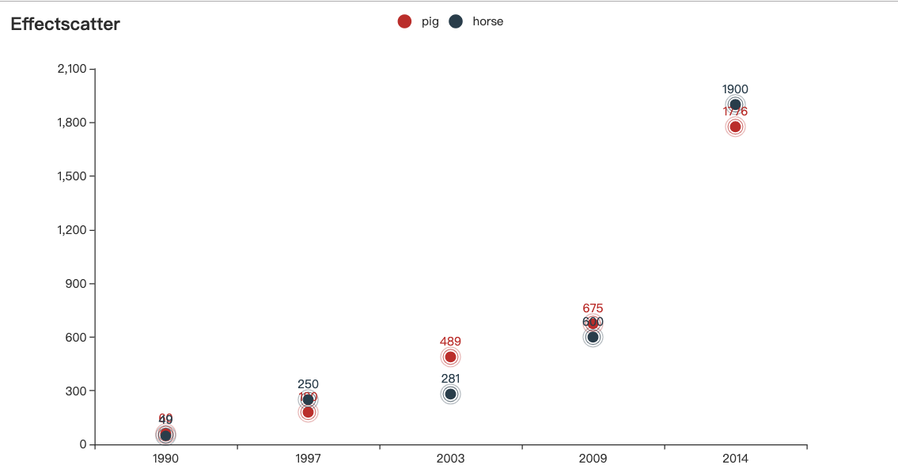
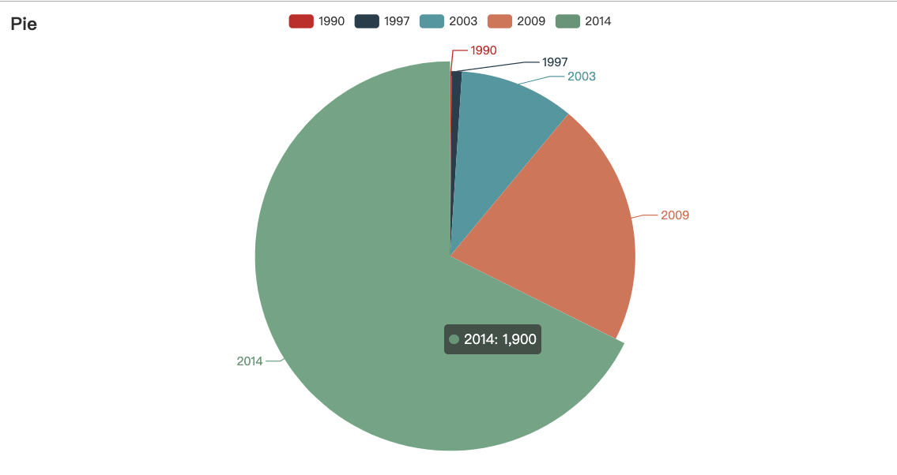

# pdchart
pandas extensions 


#### demo

```python
import pandas as pd
import pdchart

f = pd.DataFrame({
                'pig': [60, 180, 489, 675, 1776],
                'horse': [49, 250, 281, 600, 1900]}, 
                 index=[1990, 1997, 2003, 2009, 2014])

print(f)
```

dataframe look like：
```html
       pig  horse
1990    60     49
1997   180    250
2003   489    281
2009   675    600
2014  1776   1900
```

##### Drawing directly with dataframe

```python
f.pdchart.line().render()
```

```python
f.pdchart.bar().render()
```


```python
f.pdchart.scatter(effect=True).render()
```


```python
f.pdchart.pie(y='horse').render()
```

