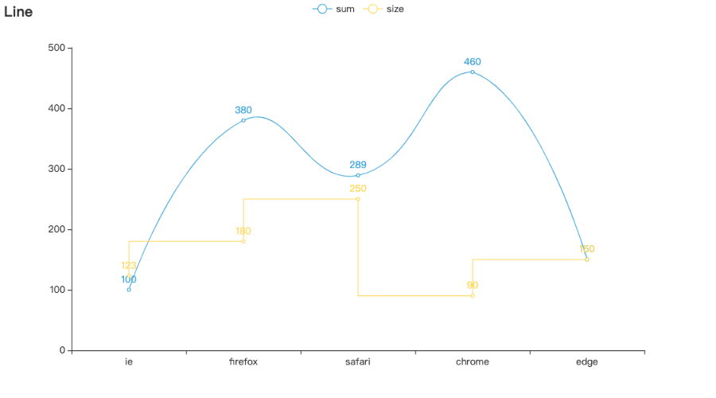
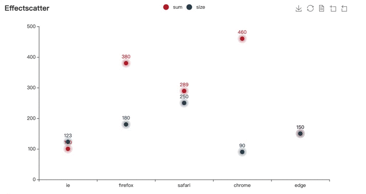

### pdchart 简介
pdchart是属于pandas的一款扩展工具，基于pandas、pyecharts基础上开发，它可以快速将你的dataframe、series数据进行可视化，并且图表比pandas原生支持的图表更精美、灵活、强大。要更好的使用pdchart您首先要对pandas、pyecharts这两款工具有一定了解，pdchart的参数配置基本是基于pyecharts封装。

[pandas 官网](http://pandas.pydata.org/)

[pyecharts 官网](https://pyecharts.org/#/zh-cn/intro)

下面简单介绍下我们应该如何使用pdchart.

PS: 下面的例子都是在jupyter book上展示.


```python
# 引入pdchart、并初始化测试数据集
import pandas as pd
import pdchart
%matplotlib inline

df = pd.DataFrame({
    'sum': [100, 380, 289, 460, 150],
    'size': [123, 180, 250, 90, 150],
    'year': [1990, 1994, 1998, 2000, 2004],
    'type': ['ie', 'firefox', 'safari', 'chrome', 'edge']
})
df
```


<div>
<table border="1" class="dataframe">
  <thead>
    <tr style="text-align: right;">
      <th></th>
      <th>sum</th>
      <th>size</th>
      <th>year</th>
      <th>type</th>
    </tr>
  </thead>
  <tbody>
    <tr>
      <th>0</th>
      <td>100</td>
      <td>123</td>
      <td>1990</td>
      <td>ie</td>
    </tr>
    <tr>
      <th>1</th>
      <td>380</td>
      <td>180</td>
      <td>1994</td>
      <td>firefox</td>
    </tr>
    <tr>
      <th>2</th>
      <td>289</td>
      <td>250</td>
      <td>1998</td>
      <td>safari</td>
    </tr>
    <tr>
      <th>3</th>
      <td>460</td>
      <td>90</td>
      <td>2000</td>
      <td>chrome</td>
    </tr>
    <tr>
      <th>4</th>
      <td>150</td>
      <td>150</td>
      <td>2004</td>
      <td>edge</td>
    </tr>
  </tbody>
</table>
</div>


### 折线图 - Line


```python
# 查看sum
df['sum'].pdchart.line().render_notebook()

# 这是series直接支持plot
```


```python
# 您还可以这样，指定x、y轴
df.pdchart.line(x='type', y=['sum', 'size']).render_notebook()

# 这是dataframe支持plot
```


```python
# 支持pyecharts中的图表配置
from pyecharts.globals import ThemeType # 引入主题

df.pdchart.line(x='type', y=['sum', 'size'], 
                init_opts={'theme': ThemeType.LIGHT},
                y_opts={'sum':{'is_smooth':True}, 'size':{'is_step':True}}).render_notebook()

# 更多的配置参数以请参考pyecharts文档
```

### 柱状图 - Bar


```python
df.pdchart.bar(x='year', y=['sum', 'size']).render_notebook()
```


### 散点图 - Scatter


```python
df.pdchart.scatter(x='type', y=['sum', 'size']).render_notebook()
```


### 涟漪散点图 - effectScatter

```python
df.pdchart.scatter(x='type', y=['sum', 'size'], effect=True).render_notebook()
```


### 饼图 - Pie


```python
df.set_index('type')['sum'].pdchart.pie().render_notebook()
```


### 词云图 - wordCloud


```python
# 上面的测试数据太少，初始化新数据
words = [
    ("Sam S Club", 10000),
    ("Macys", 6181),
    ("Amy Schumer", 4386),
    ("Jurassic World", 4055),
    ("Charter Communications", 2467),
    ("Chick Fil A", 2244),
    ("Planet Fitness", 1868),
    ("Pitch Perfect", 1484),
    ("Express", 1112),
    ("Home", 865),
    ("Johnny Depp", 847),
    ("Lena Dunham", 582),
    ("Lewis Hamilton", 555),
    ("KXAN", 550),
    ("Mary Ellen Mark", 462),
    ("Farrah Abraham", 366),
    ("Rita Ora", 360),
    ("Serena Williams", 282),
    ("NCAA baseball tournament", 273),
    ("Point Break", 265),
]

new_df = pd.DataFrame(words, columns=['name', 'num'])
new_df.head(5)
```


<div>
<table border="1" class="dataframe">
  <thead>
    <tr style="text-align: right;">
      <th></th>
      <th>name</th>
      <th>num</th>
    </tr>
  </thead>
  <tbody>
    <tr>
      <th>0</th>
      <td>Sam S Club</td>
      <td>10000</td>
    </tr>
    <tr>
      <th>1</th>
      <td>Macys</td>
      <td>6181</td>
    </tr>
    <tr>
      <th>2</th>
      <td>Amy Schumer</td>
      <td>4386</td>
    </tr>
    <tr>
      <th>3</th>
      <td>Jurassic World</td>
      <td>4055</td>
    </tr>
    <tr>
      <th>4</th>
      <td>Charter Communications</td>
      <td>2467</td>
    </tr>
  </tbody>
</table>
</div>


```python
new_df.pdchart.wordCloud(label='name', value='num').render_notebook()
```


### 时序图 - timeline


```python
# 加载新的测试数据集
mdf = pd.DataFrame({
    'year': [str(i) + '年' for i in
             [2001, 2002, 2003, 2004, 2001, 2002, 2003, 2004, 2001, 2002, 2003, 2004, 2001, 2002, 2003, 2004]],
    'size': [490, 250, 271, 650, 190, 250, 289, 600, 290, 250, 181, 208, 190, 250, 291, 390],
    'sum': [190, 350, 278, 450, 290, 290, 289, 600, 390, 150, 181, 258, 290, 550, 391, 280],
    'type': ['firefox', 'firefox', 'firefox', 'firefox', 'safari', 'safari', 'safari', 'safari', 'chrome', 'chrome',
             'chrome', 'chrome', 'edge', 'edge', 'edge', 'edge']
})

mdf.head(5)
```


<div>
<table border="1" class="dataframe">
  <thead>
    <tr style="text-align: right;">
      <th></th>
      <th>year</th>
      <th>size</th>
      <th>sum</th>
      <th>type</th>
    </tr>
  </thead>
  <tbody>
    <tr>
      <th>0</th>
      <td>2001年</td>
      <td>490</td>
      <td>190</td>
      <td>firefox</td>
    </tr>
    <tr>
      <th>1</th>
      <td>2002年</td>
      <td>250</td>
      <td>350</td>
      <td>firefox</td>
    </tr>
    <tr>
      <th>2</th>
      <td>2003年</td>
      <td>271</td>
      <td>278</td>
      <td>firefox</td>
    </tr>
    <tr>
      <th>3</th>
      <td>2004年</td>
      <td>650</td>
      <td>450</td>
      <td>firefox</td>
    </tr>
    <tr>
      <th>4</th>
      <td>2001年</td>
      <td>190</td>
      <td>290</td>
      <td>safari</td>
    </tr>
  </tbody>
</table>
</div>


```python
mdf.pdchart.bar(x='type', y=['size', 'sum'], timeline='year').render_notebook()
```


```python
mdf.pdchart.line(x='type', y=['size', 'sum'], timeline='year').render_notebook()
```


```python
mdf.pdchart.pie(label='type', value='size', timeline='year', 
                 val_opts={'rosetype': 'radius', 'radius': ["30%", "55%"]}).render_notebook()
```


### 3D 图表 

开发中......


更多的图表后续会陆续支持起来，谢谢支持！
